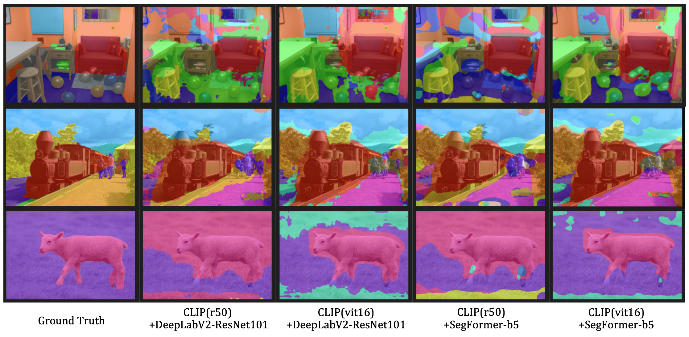

# Improvement MaskCLIP and MaskCLIP+ with Class Weight and SegFormer
code base : [official MaskCLIP repo](https://github.com/chongzhou96/MaskCLIP), [mmsegmentation](https://github.com/open-mmlab/mmsegmentation)

This repository contains the implementation and results of two improved version of [MaskCLIP](https://arxiv.org/abs/2112.01071)

Improve method 1 : incorporates a new classifier that places greater weight on classes predicted by CLIP.

Improve method 2 : uses the Segformer backbone instead of DeepLabv2-ResNet101.


# Results of *Improve method 1*

## MaskCLIP Performance

<table>
    <tr>
        <th>MaskCLIP(RN50)</th>
        <th>mIoU</th>
        <th>config</th>
        <th>json</th>
    </tr>
    <tr>
        <td> base  </td>
        <td>18.46</td>
        <th><a href="https://github.com/dgymjol/MaskCLIP_SegFormer/blob/master/configs/maskclip/maskclip_r50_520x520_pascal_context_59.py">config</a></th>
        <th><a href="https://github.com/dgymjol/MaskCLIP_SegFormer/blob/master/work_dirs/maskclip_r50_520x520_pascal_context_59/eval_single_scale_20230427_211723.json">json</a></th>
    </tr>
    <tr>
        <td> + class weight (tau=0.25)</td>
        <td> <strong>20.54 </strong></td>
        <th><a href="https://github.com/dgymjol/MaskCLIP_SegFormer/blob/master/configs/maskclip_text/maskclip_text_r50_520x520_pascal_context_59.py">config</a></th>
        <th><a href="https://github.com/dgymjol/MaskCLIP_SegFormer/blob/master/work_dirs/maskclip-text-vit16/r50/eval_single_scale_20230521_161506.json">json</a></th>
    </tr>
</table>

<table>
    <tr>
        <th>MaskCLIP(ViT16)</th>
        <th>mIoU</th>
        <th>config</th>
        <th>json</th>
    </tr>
    <tr>
        <td> base  </td>
        <td>21.68</td>
        <th><a href="https://github.com/dgymjol/MaskCLIP_SegFormer/blob/master/configs/maskclip/maskclip_vit16_520x520_pascal_context_59.py">config</a></th>
        <th><a href="https://github.com/dgymjol/MaskCLIP_SegFormer/blob/master/work_dirs/maskclip_vit16_520x520_pascal_context_59/eval_single_scale_20230427_214100.json">json</a></th>
    </tr>
    <tr>
        <td> + class weight (tau=1)</td>
        <td> <strong>24.96 </strong></td>
        <th><a href="https://github.com/dgymjol/MaskCLIP_SegFormer/blob/master/configs/maskclip_text/maskclip_text_vit16_520x520_pascal_context_59.py">config</a></th>
        <th><a href="https://github.com/dgymjol/MaskCLIP_SegFormer/blob/master/work_dirs/maskclip-text-vit16/vit16/eval_single_scale_20230521_164456.json">json</a></th>
    </tr>
</table> 


## MaskCLIP+ Annotation-Free Segmentation Performance

<table>
    <tr>
        <th>MaskCLIP+(RN50)</th>
        <th>mIoU</th>
        <th>config</th>
        <th>log</th>
    </tr>
    <tr>
        <td> base  </td>
        <td>24.82</td>
        <th><a href="https://github.com/dgymjol/MaskCLIP_SegFormer/blob/master/work_dirs/anno_free/r50-dl2/maskclip_plus_r50_deeplabv2_r101-d8_480x480_4k_pascal_context_59.py">config</a></th>
        <th><a href="https://github.com/dgymjol/MaskCLIP_SegFormer/blob/master/work_dirs/anno_free/r50-dl2/20230220_004900.log">log</a></th>
    </tr>
    <tr>
        <td> + class weight (tau=0.25)</td>
        <td> <strong> 25.96 </strong></td>
        <th><a href="https://github.com/dgymjol/MaskCLIP_SegFormer/blob/master/work_dirs/anno_free/r50-dl2-text-vit16/maskclip_plus_r50_deeplabv2_r101-d8_class_weight_480x480_4k_pascal_context_59.py">config</a></th>
        <th><a href="https://github.com/dgymjol/MaskCLIP_SegFormer/blob/master/work_dirs/anno_free/r50-dl2-text-vit16/20230521_191842.log">json</a></th>
    </tr>
</table>

<table>
    <tr>
        <th>MaskCLIP+(ViT16)</th>
        <th>mIoU</th>
        <th>config</th>
        <th>log</th>
    </tr>
    <tr>
        <td> base  </td>
        <td>31.56</td>
        <th><a href="https://github.com/dgymjol/MaskCLIP_SegFormer/blob/master/work_dirs/anno_free/vit-dlv2/maskclip_plus_vit16_deeplabv2_r101-d8_480x480_4k_pascal_context_59.py">config</a></th>
        <th><a href="https://github.com/dgymjol/MaskCLIP_SegFormer/blob/master/work_dirs/anno_free/vit-dlv2/20230219_231252.log">log</a></th>
    </tr>
    <tr>
        <td> + class weight (tau=1)</td>
        <td> <strong>32.42</strong></td>
        <th><a href="https://github.com/dgymjol/MaskCLIP_SegFormer/blob/master/work_dirs/anno_free/vit-dlv2-text-vit16/maskclip_plus_vit16_deeplabv2_r101-d8_class_weight_480x480_4k_pascal_context_59.py">config</a></th>
        <th><a href="https://github.com/dgymjol/MaskCLIP_SegFormer/blob/master/work_dirs/anno_free/vit-dlv2-text-vit16/20230521_171058.log">json</a></th>
    </tr>
</table>


# Results of *Improve method 2*

## MaskCLIP+ Annotation-Free Segmentation Performance
<table>
    <tr>
        <th>CLIP backbone</th>
        <th>Segmentor</th>
        <th>mIoU</th>
        <th>Total Params</th>
        <th>config</th>
        <th>log</th>
    </tr>
    <tr>
        <td rowspan=2>CLIP(ResNet50)</td>
        <td>  DeepLabv2-ResNet101 </td>
        <td> <strong>24.82 </strong></td>
        <td> 156M </td>
        <th><a href="https://github.com/dgymjol/MaskCLIP_SegFormer/blob/master/work_dirs/anno_free/r50-dl2/maskclip_plus_r50_deeplabv2_r101-d8_480x480_4k_pascal_context_59.py">config</a></th>
        <th><a href="https://github.com/dgymjol/MaskCLIP_SegFormer/blob/master/work_dirs/anno_free/r50-dl2/20230220_004900.log">log</a></th>
    </tr>
    <tr>
        <td>SegFormer-b5</td>
        <td> 22.87</td>
        <td> 125M</td>
        <th><a href="https://github.com/dgymjol/MaskCLIP_SegFormer/blob/master/work_dirs/anno_free/r50-sfb5/maskclip_plus_r50_segformer_b5_480x480_8k_pascal_context_59.py">config</a></th>
        <th><a href="https://github.com/dgymjol/MaskCLIP_SegFormer/blob/master/work_dirs/anno_free/r50-sfb5/20230219_195921.log">log</a></th>
    </tr>
    <tr>
        <td rowspan=2>CLIP(ViT16)</td>
        <td>  DeepLabv2-ResNet101 </td>
        <td> 31.56 </td>
        <td> 166M </td>
        <th><a href="https://github.com/dgymjol/MaskCLIP_SegFormer/blob/master/work_dirs/anno_free/vit-dlv2/maskclip_plus_vit16_deeplabv2_r101-d8_480x480_4k_pascal_context_59.py">config</a></th>
        <th><a href="https://github.com/dgymjol/MaskCLIP_SegFormer/blob/master/work_dirs/anno_free/vit-dlv2/20230219_231252.log">log</a></th>
    </tr>
    <tr>
        <td>SegFormer-b5</td>
        <td> <strong>33.88</strong></td>
        <td> 169M</td>
        <th><a href="https://github.com/dgymjol/MaskCLIP_SegFormer/blob/master/work_dirs/anno_free/vit-sfb5/maskclip_plus_vit16_segformer_b5_480x480_8k_pascal_context_59.py">config</a></th>
        <th><a href="https://github.com/dgymjol/MaskCLIP_SegFormer/blob/master/work_dirs/anno_free/vit-sfb5/20230219_124812.log">log</a></th>
    </tr>
</table>



# Setup
**Step 0.**  Make a conda environment
```shell
bash env_install.sh
```

**Step 1.**  Dataset Preparation (ref : [dataset_prepare.md](docs/en/dataset_prepare.md#prepare-datasets))

```shell
bash pascal_context_preparation.sh
```

**Step 2.**  Download and convert the CLIP models & Prepare the text embeddings

```shell
bash download_weights.sh
```

**Step 3.**  Download the SegFormer weights pretrained on ImageNet-1 at [here](https://github.com/NVlabs/SegFormer#trainings) and locate them in `pretrain` folder

**Step 4.** Convert pretrained mit models to MMSegmentation style
```shell
python tools/model_converters/mit2mmseg.py pretrain/mit_b0.pth pretrain/mit_b0_weight.pth
```

# MaskCLIP
**ONLY Inference.** 

Get quantitative results (mIoU):
```shell
python tools/test.py ${CONFIG_FILE} ${CHECKPOINT_FILE} --eval mIoU
```
Get qualitative results:
```shell
python tools/test.py ${CONFIG_FILE} ${CHECKPOINT_FILE} --show-dir ${OUTPUT_DIR}
```

# MaskCLIP+

MaskCLIP+ trains another segmentation model(SegFormer) with pseudo labels extracted from MaskCLIP.

**Train.** (please refer to [train.md](docs/en/train.md)

```shell
# if single GPUs, (examples in exp_1.sh)
python tools/train.py ${CONFIG_FILE}

# if multiple GPUs, (examples in exp_2.sh)
bash tools/dist_train.sh ${CONFIG_FILE} ${GPU_NUM}
```

**Inference.** 

Get quantitative results (mIoU):
```shell
python tools/test.py ${CONFIG_FILE} ${CHECKPOINT_FILE} --eval mIoU
```
Get qualitative results:
```shell
python tools/test.py ${CONFIG_FILE} ${CHECKPOINT_FILE} --show-dir ${OUTPUT_DIR}
```

# Troubleshooting

**Error 0.** ImportError: libGL.so.1: cannot open shared object file: No such file or directory
```shell
sudo apt-get update
sudo apt-get install libgl1
```

**Error 1.** `ImportError: MagickWand shared library not found.`
```shell
sudo apt-get update
sudo apt-get install libmagickwand-dev
```

**Error 2.** `ImportError: /usr/lib/x86_64-linux-gnu/libstdc++.so.6: version GLIBCXX_3.4.29 not found `
```shell
sudo add-apt-repository ppa:ubuntu-toolchain-r/test
sudo apt-get install --only-upgrade libstdc++6
```

# Citation
the code base is  MaskCLIP
```
@InProceedings{zhou2022maskclip,
    author = {Zhou, Chong and Loy, Chen Change and Dai, Bo},
    title = {Extract Free Dense Labels from CLIP},
    booktitle = {European Conference on Computer Vision (ECCV)},
    year = {2022}
}
```