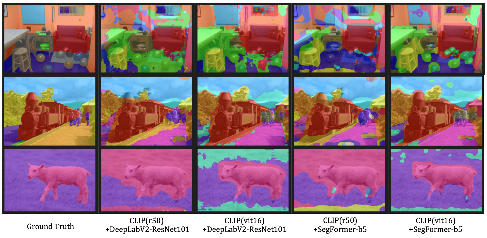

# MaskCLIP+ with SegFormer

MaskCLIP paper: [Extract Free Dense Labels from CLIP](https://arxiv.org/abs/2112.01071).

Official MaskCLIP code : [MaskCLIP github](https://github.com/chongzhou96/MaskCLIP)

This repository contains an implementation of MaskCLIP+ that uses the Segformer backbone instead of DeepLabv2

# Annotation-Free Segmentation Performance

<table>
    <tr>
        <th>CLIP backbone</th>
        <th>Segmentor</th>
        <th>mIoU</th>
        <th>Total Params</th>
    </tr>
    <tr>
        <td rowspan=2>CLIP(RN50)</td>
        <td>  DeepLabv2-ResNet101 </td>
        <td> <strong>24.82 </strong></td>
        <td> 156M </td>
    </tr>
    <tr>
        <td>SegFormer-b5</td>
        <td> 22.87</td>
        <td> 125M</td>
    </tr>
    <tr>
        <td rowspan=2>CLIP(ViT16)</td>
        <td>  DeepLabv2-ResNet101 </td>
        <td> 31.56 </td>
        <td> 166M </td>
    </tr>
    <tr>
        <td>SegFormer-b5</td>
        <td> <strong>33.88</strong></td>
        <td> 169M</td>
    </tr>
</table>



# Setup
**Step 0.**  Make a conda environment
```shell
bash env_install.sh
```

**Step 1.**  Dataset Preparation (ref : [dataset_prepare.md](docs/en/dataset_prepare.md#prepare-datasets))

```shell
bash pascal_context_preparation.sh
```

**Step 2.**  Download and convert the CLIP models & Prepare the text embeddings

```shell
bash download_weights.sh
```

**Step 3.**  Download the SegFormer weights pretrained on ImageNet-1 at [here](https://github.com/NVlabs/SegFormer#trainings) and locate them in `pretrain` folder

**Step 4.** Convert pretrained mit models to MMSegmentation style
```shell
python tools/model_converters/mit2mmseg.py pretrain/mit_b0.pth pretrain/mit_b0_weight.pth
```

# MaskCLIP+

MaskCLIP+ trains another segmentation model(SegFormer) with pseudo labels extracted from MaskCLIP.

**Train.** (please refer to [train.md](docs/en/train.md)

```shell
# if single GPUs, (examples in exp_1.sh)
python tools/train.py ${CONFIG_FILE}

# if multiple GPUs, (examples in exp_2.sh)
bash tools/dist_train.sh ${CONFIG_FILE} ${GPU_NUM}
```

**Inference.** 

Get quantitative results (mIoU):
```shell
python tools/test.py ${CONFIG_FILE} ${CHECKPOINT_FILE} --eval mIoU
```
Get qualitative results:
```shell
python tools/test.py ${CONFIG_FILE} ${CHECKPOINT_FILE} --show-dir ${OUTPUT_DIR}
```

In exp.sh, there are many examples
# Citation
the code base is  MaskCLIP
```
@InProceedings{zhou2022maskclip,
    author = {Zhou, Chong and Loy, Chen Change and Dai, Bo},
    title = {Extract Free Dense Labels from CLIP},
    booktitle = {European Conference on Computer Vision (ECCV)},
    year = {2022}
}
```